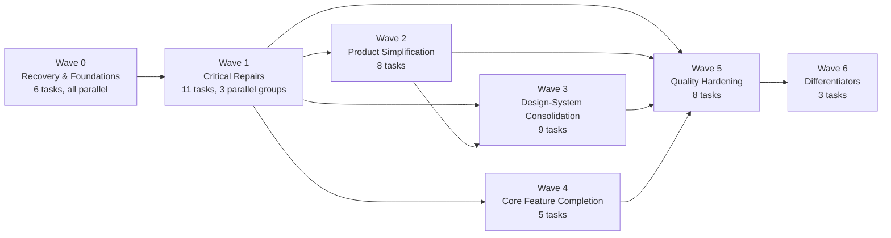
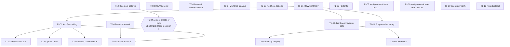

# 05 — Task Dependency Graph

## Wave-level flow

Waves 2 and 3 both depend only on Wave 1 (not on each other in full) — see the per-task graph below for the specific cross-wave edges, since several Wave 3 tasks have no Wave 2 dependency and could start as soon as their Wave 1 prerequisite lands.

## Critical path (longest dependency chain)

**Chain A — booking data integrity (the audit's #1 cluster):**
`T0-05 (choose test framework)` → `T1-01 (lockSeat wiring)` → `T1-02 (checkout re-port, same branch)` → `T5-01 (test tranche 1, validates T1-01's concurrency fix)`. This is the longest true chain in the plan — everything else can parallelize around it. It also gates `T2-04` (promo field) and `T2-08` (cancel consolidation), both flagged "best done with T1-01" in `roadmap.csv`.

**Chain B — performance/security root cause:**
`T1-11 (Suspense boundary)` → `T3-08 (CSP nonce, must follow to avoid caching/nonce conflict)`, and separately `T1-11` → `T2-01 (landing simplification, needs static rendering fixed first)`.

**Chain C — product-owner-gated:**
`Open Decision #1` → `T1-04 (centers creation-or-hide)`; `Open Decision #2` → `T6-01 (parent accounts)`; `Open Decision #4` → `T4-05 (notifications)`; `Open Decision #7` → `T4-01 (email verification)`. None of these have a code-side blocker — they're blocked purely on `13-open-owner-decisions.md` being resolved, and should not be scheduled into a wave's parallel group until then.

## Detailed graph — Wave 0 → Wave 1 (the highest-density dependency cluster)

Everything in Wave 0 is mutually independent (parallel group `0-all`). Within Wave 1, three parallel groups exist:
- **`1-a`**: `T1-01` + `T1-02` — same branch (`overhaul/booking-seat-lock`), must land together, sequential within the pair but independent of the rest of Wave 1.
- **`1-b`**: `T1-03`, `T1-06`, `T1-07`, `T1-09`, `T1-10` — fully independent mechanical fixes, safe to run as five simultaneous Codex worktrees.
- **`1-c`**: `T1-05`, `T1-08` — both Type E (high-risk), each needs Claude's full review cycle; can run in parallel with each other and with `1-a`/`1-b` since they touch disjoint files.
- **`1-d-solo`**: `T1-11` — touches root layout, deliberately *not* parallelized with anything else that touches `app/layout.tsx` (none currently do, so this is a precaution, not an active conflict).
- `T1-04` is excluded from all parallel groups until Open Decision #1 resolves.

## Cross-cutting "do not parallelize" pairs

| Pair | Reason |
|---|---|
| `T1-01` / `T1-02` | Same file (`BookingCheckout.tsx`), same data contract — must be one branch |
| `T1-11` / any other `app/layout.tsx` edit | Root layout is a shared-foundation file, see `07-shared-foundations-and-file-ownership.md` |
| `T1-11` / `T3-08` | CSP nonce generation and the Suspense/caching fix interact; sequence, don't parallelize |
| `T4-02` (CSRF, ~85 routes) / any other task touching the same route files in the same wave | Route-file collision risk — Claude's task packet for T4-02 lists the exact route list to avoid overlap with concurrent Wave 4 work |
| `T3-05`/`T3-06` (shared components) / any task migrating a call site to them | Build the component first, then migrate — not simultaneously, or migrations target a moving API |
