# 12 — Full Overhaul Roadmap

Narrative view of `06-parallel-execution-waves.md`'s 7 waves, plus the release checklist the master brief asks for. Task-level detail lives in `tasks.json`; phase-level evidence lives in `audit/13-prioritized-overhaul-roadmap.md`.

## Timeline shape

Waves 0 and 1 are sequential (1 depends on 0). Waves 2, 3, and 4 all depend only on Wave 1 and can run **concurrently** once it closes — they touch largely disjoint files (product simplification, design-system, and feature-completion don't structurally overlap, per `04-work-breakdown-structure.md`'s scope table). Wave 5 depends on the non-blocked outputs of 2/3/4. Wave 6 depends on Wave 5.

```mermaid
gantt
    dateFormat X
    axisFormat %s
    section Sequential spine
    Wave 0 Recovery           :w0, 0, 1
    Wave 1 Critical Repairs   :w1, after w0, 2
    section Concurrent once Wave 1 closes
    Wave 2 Product Simplification :w2, after w1, 2
    Wave 3 Design System          :w3, after w1, 2
    Wave 4 Feature Completion     :w4, after w1, 2
    section Convergent
    Wave 5 Quality Hardening  :w5, after w2 w3 w4, 2
    Wave 6 Release Prep       :w6, after w5, 1
```

(Units are relative sprints, not calendar weeks — sizing depends on actual agent throughput, not estimated here.)

## Phase-by-phase summary

**Wave 0 — Recovery & Foundations.** 6 tasks, all Claude-led, all parallel. Closes the tooling gaps (`audit/11`'s capability matrix) that every later wave's verification depends on.

**Wave 1 — Critical Repairs.** 11 tasks (10 active, 1 blocked). Closes 6 of 7 Critical-severity findings outright; the 7th (`UX-JOURNEY-008`/centers) is blocked on Open Decision #1, not engineering capacity. See `11-first-implementation-sprint.md` for the standalone sprint brief.

**Wave 2 — Product Simplification.** 8 tasks. Landing page (isolated, single-owner per the master brief's explicit instruction), dead-feature wiring (referral/promo/reviews/admin buttons), legal pages, orphaned routes.

**Wave 3 — Design-System Consolidation.** 9 tasks. i18n wiring on the 4 highest-leverage surfaces, RTL/formatting/terminology fixes, two new shared components (icon-button, Modal), CSP nonce, cookie-based `lang`/`dir`.

**Wave 4 — Core Feature Completion.** 5 tasks (3 active, 2 blocked on decisions). CSRF consistency, mobile auth parity, real migration history; email verification and notifications gated on product decisions.

**Wave 5 — Quality Hardening.** 8 tasks. Test tranche 1, SEO baseline, dependency maintenance, README, perf polish, code cleanup — this is where `audit-closure.csv`'s 24 `folded_into_task` rows mostly land.

**Wave 6 — Release Preparation / Differentiators.** 3 tasks plus the checklist below.

## Release checklist (Wave 6 exit gate)

| Item | Owner | Method |
|---|---|---|
| Production configuration confirmed | Claude | Manual review — no CI/CD pipeline exists yet (`audit/11` §0), so this is a checklist, not an automated gate |
| Data migration rehearsal | Claude + Codex | Only relevant if `T4-04`'s migration history includes any schema change queued for this release; run against a Supabase branch via MCP, not directly against production |
| Final link crawl | Codex | Full Playwright-MCP-driven crawl of all 31 routes, both languages — the mature version of the `T0-01` baseline |
| Final asset validation | Codex | Confirm every image referenced in `assets.csv` resolves; confirm `T6-03`'s generated assets are integrated, not just produced |
| Final permissions review | Claude | Re-check every route's `proxy.ts` gate against `routes.json`'s intended auth/role, specifically re-verifying `T1-03`'s and `T1-11`'s changes didn't loosen anything unintentionally |
| Monitoring | Claude (decision), Codex (setup if approved) | No monitoring currently exists — this is a new Open Decision if the product owner wants it before launch; not assumed |
| Analytics | Claude (decision), Codex (setup if approved) | Same — not currently instrumented, not assumed as in-scope unless requested |
| Backups | Product owner | Supabase's own backup policy — outside this plan's authority to configure |
| Rollback plan | Claude | One paragraph per Wave-6-eligible change, keyed to the branch each task landed on (branch names are already in `tasks.json`, making `git revert` straightforward per task) |
| Launch checklist sign-off | Claude | Final gate — no Wave 6 item is "done" until Claude explicitly signs off against `audit-closure.csv` showing zero remaining `ready`/`blocked-by-wave` Critical or High findings |
| Post-launch validation | Codex | Re-run the full Playwright baseline against the live/production build, not just `main` |

## What "done" means for this overhaul

Every row in `audit-closure.csv` is `done`, `deferred` (explicitly, not by omission), or `closed` — and every Critical/High-severity row specifically is `done`, per the severity coverage check in `10-audit-closure-matrix.md`.
